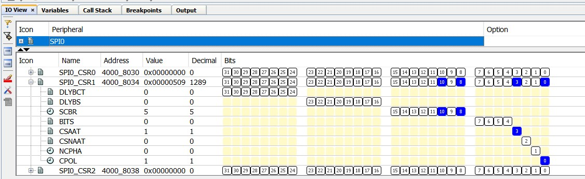
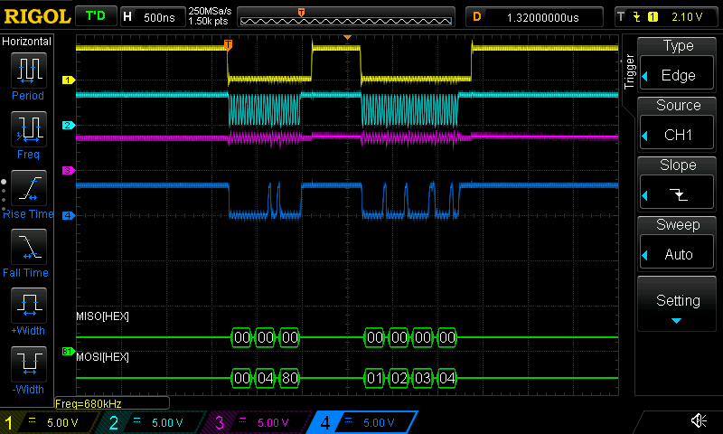

# Sample App to demonstrate CSAAT issue on SAME70

rdpoor@gmail.com
April 2022

## Description of the problem

The SAME70 / S70 documentation for SPI states:

> To facilitate interfacing with [some SPI slave peripherals], the chip select
> registers [SPI_CSR0...SPI_CSR3] can be programmed with the Chip Select Active
> After Transfer (CSAAT) bit at 1. This allows the chip select lines to remain
> in their current state (low = active) until a transfer to another chip select
> is required. Even if SPI_TDR is not reloaded, the chip select remains active.

However, this doesn't seem to be the case.  The example app shown here has this
as an inner loop:

```
unsigned char preamble[] = {0x00, 0x04, 0x80};
unsigned char payload[] = {0x01, 0x02, 0x03, 0x04};

// Because CSAAT is set, NPCS1 (chip select) should stay low across
// the two SPI0_WriteRead() calls
SPI0_ChipSelectSetup(SPI_CHIP_SELECT_NPCS1);
SPI0_WriteRead((void *) preamble, sizeof(preamble), NULL, 0);
SPI0_WriteRead((void *) payload, sizeof(payload), NULL, 0);
SYSTICK_DelayMs(1);
```

And in  you can see that the CSAAT
bit is set in the register, yet NPCS1 does de-assert (goes high) between writing
the preamble and writing the payload.

See  for the resulting output.

The top trace (yellow) is chip select. It should be staying low between
the two transfers.

You can see:
1. Chip select asserts (goes low)
2. The preamble is transmitted (0x00, 0x04, 0x80)
3. Chip select de-asserts (goes high), then re-asserts (goes low)
4. The payload is transmitted (0x01, 0x02, 0x03, 0x04)

However, since CSAAT is asserted, the chip select should be staying asserted.

## To replicate

* Build and load the application into a SAME70 XULT board.
* Optional: connect a terminal emulator to EDBG, 115200 baud 8n1.
* Connect a scope as follows (J505 provides convenient access):

```
PD25 NPCS1
PD22 SCK
PD20 MISO (not active)
PD21 MOSI
```

Verify that the output matches the description above.
